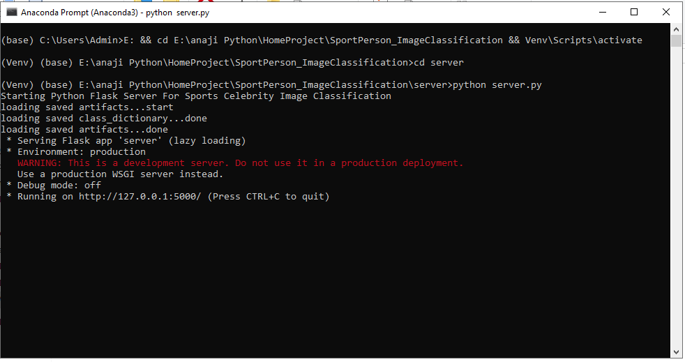
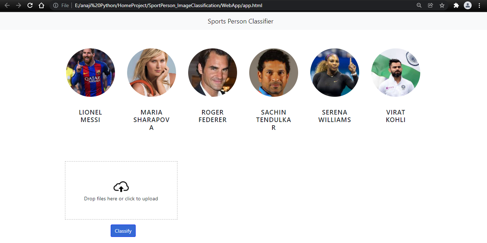
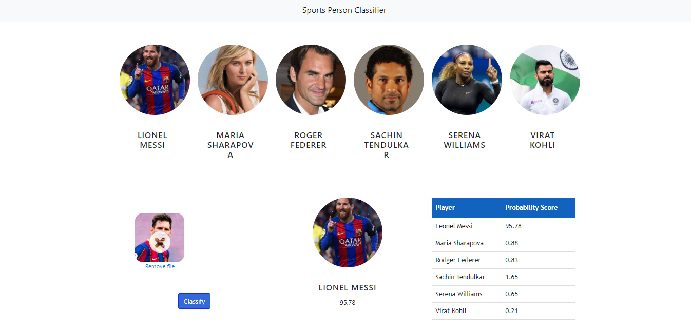
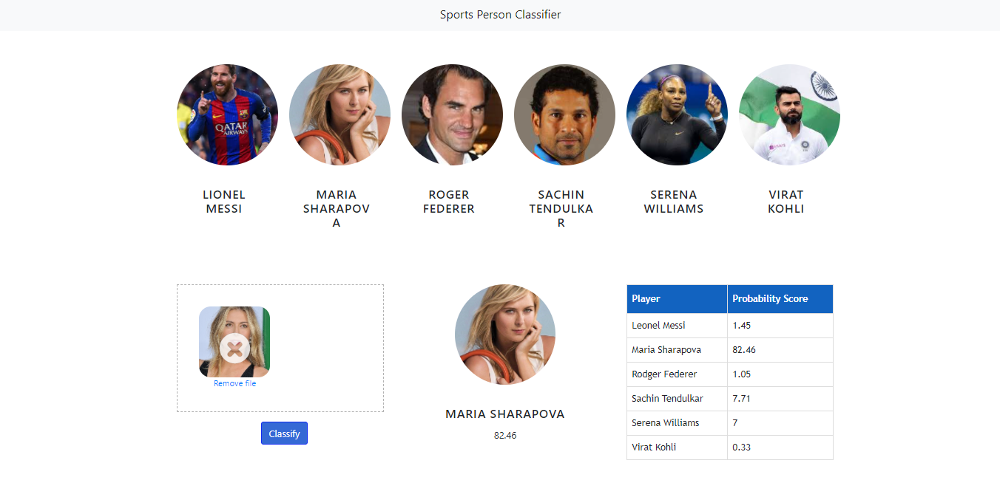
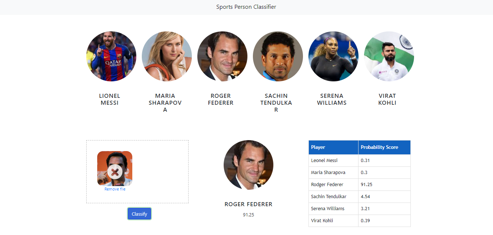
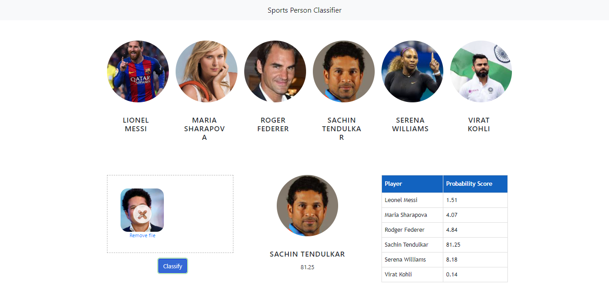
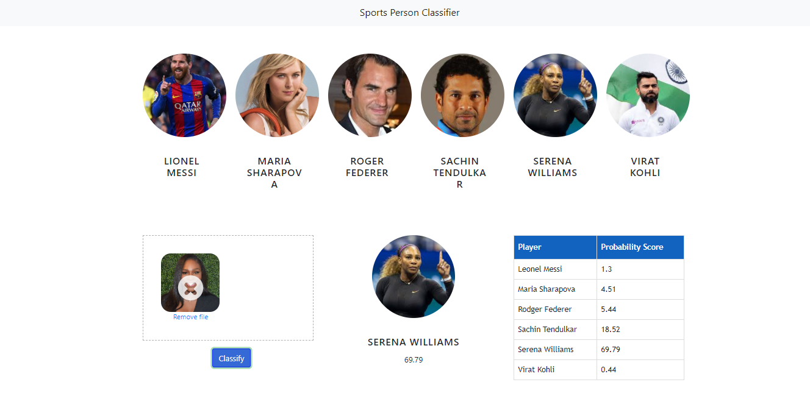
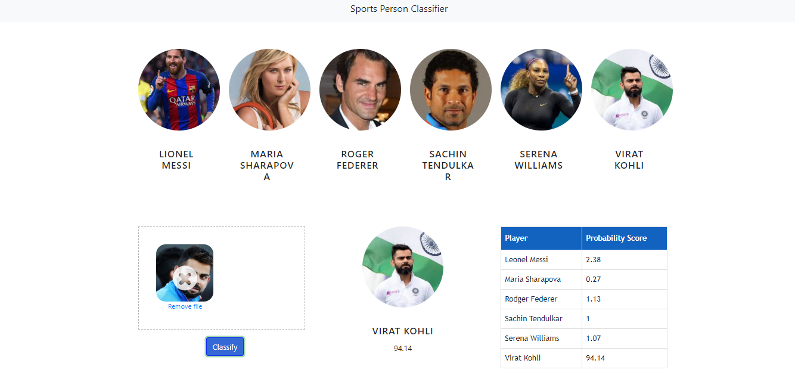
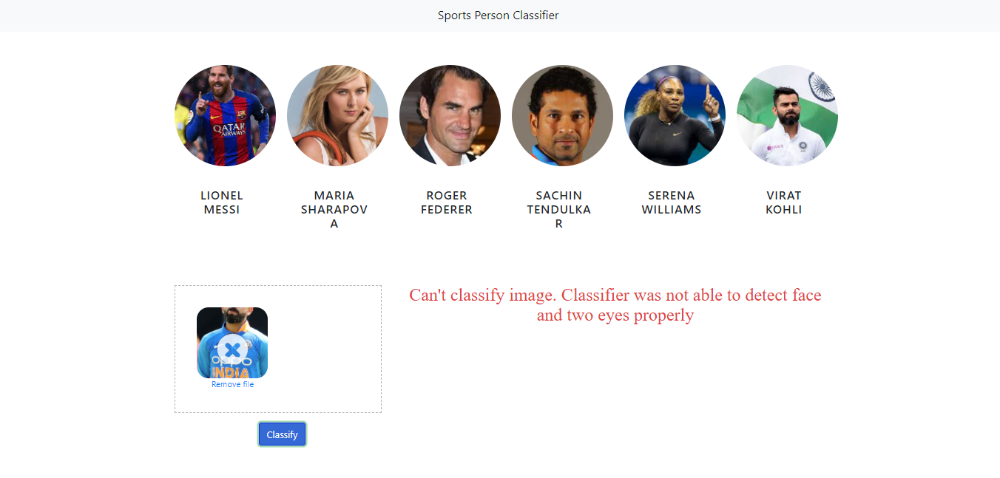
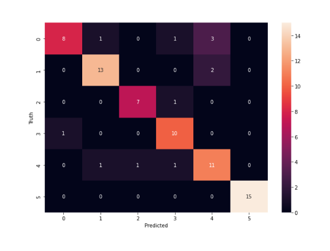

# SportPerson_ImageClassification
6 Sport Persons face Image Classification using Machine Learning and OpenCV, Flask Server.

-----
## Images

## Run Flask In Cmd:

------
## Web app for Project:

------
## Image for 1th person:

------
## Image for 2nd person:

------
## Image for 3rd person:

------
## Image for 4th person:

------
## Image for 5th person:

------
## Image for 6th person:

------
## Error when no Face detected:

-----
## Heatmap for classes

